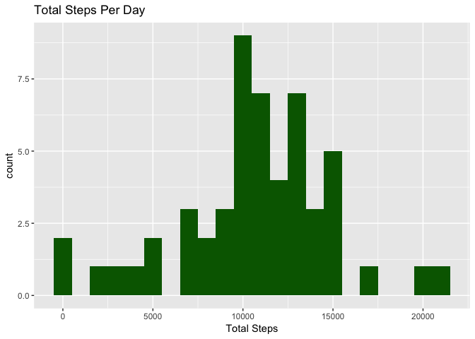
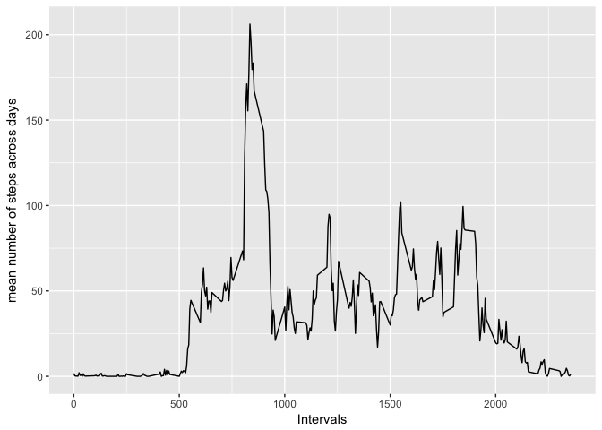
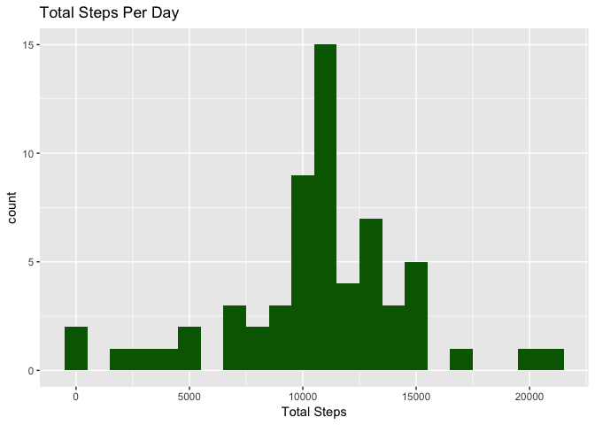
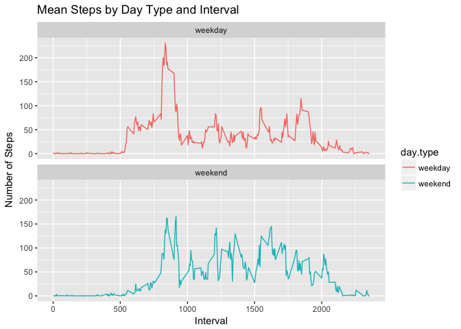

# Reproducible Research: Peer Assessment 1


## Loading and preprocessing the data

```r
#1. Load the data.
unzip("./activity.zip")
activityMonitorData <- read.csv("./activity.csv")

#2. Process/transform the data into a format suitable for the analysis.
activityMonitorData$date <- as.Date(activityMonitorData$date, format = "%Y-%m-%d")

str(activityMonitorData)
```

```
## 'data.frame':	17568 obs. of  3 variables:
##  $ steps   : int  NA NA NA NA NA NA NA NA NA NA ...
##  $ date    : Date, format: "2012-10-01" "2012-10-01" ...
##  $ interval: int  0 5 10 15 20 25 30 35 40 45 ...
```


## What is mean total number of steps taken per day?

```r
#For this part of the assignment, you can ignore the missing values in the dataset.

#1. Calculate the total number of steps taken per day
totalStepsByDay <- aggregate(steps ~ date, activityMonitorData, sum)

#2. Make a histogram of the total number of steps taken per day.
library(ggplot2)
ggplot(data = totalStepsByDay, aes(steps)) + 
  geom_histogram(binwidth = 1000, fill = "darkgreen") + 
  labs(title = "Total Steps Per Day") +
  labs(x = "Total Steps")
```

<!-- -->

```r
#3. Calculate and report the mean and median of the total number of steps taken per day.
meanSteps <- mean(totalStepsByDay$steps, na.rm = TRUE)
meanSteps
```

```
## [1] 10766.19
```

```r
medianSteps <- median(totalStepsByDay$steps, na.rm = TRUE)
medianSteps
```

```
## [1] 10765
```


## What is the average daily activity pattern?

```r
# 1. Make a time series plot (i.e. 𝚝𝚢𝚙𝚎 = "𝚕") of the 5-minute interval (x-axis) and the average number of steps taken, averaged across all days (y-axis)
cleanSteps <- subset(activityMonitorData, !is.na(activityMonitorData$steps))
intervalMeans <- tapply(cleanSteps$steps, cleanSteps$interval, mean)

intervalMeansDF <- data.frame(interval = as.integer(names(intervalMeans)), mean.value = intervalMeans)

ggplot(intervalMeansDF, aes(x = interval, y = mean.value)) + geom_line() +
  xlab("Intervals") + ylab("mean number of steps across days")
```

<!-- -->

```r
#2. Which 5-minute interval, on average across all the days in the dataset, contains the maximum number of steps?
maxSteps <- max(intervalMeansDF$mean.value)
intervalMeansDF[intervalMeansDF$mean.value == maxSteps, ]
```

```
##     interval mean.value
## 835      835   206.1698
```

## Imputing missing values

```r
#Note that there are a number of days/intervals where there are missing values (coded as 𝙽𝙰). The presence of missing days may introduce bias into some calculations or summaries of the data.

#1. Calculate and report the total number of missing values in the dataset (i.e. the total number of rows with 𝙽𝙰s)
sum(is.na(activityMonitorData$steps))
```

```
## [1] 2304
```

```r
#2. Devise a strategy for filling in all of the missing values in the dataset. The strategy does not need to be sophisticated. For example, you could use the mean/median for that day, or the mean for that 5-minute interval, etc.
#Desided to take the mean number of steps per interval and use that to fill in the missing values.

#3. Create a new dataset that is equal to the original dataset but with the missing data filled in.

activityMonitorData2<- activityMonitorData
naIdentifierList<- is.na(activityMonitorData2$steps)

# show how many NA values exist
sum(is.na(activityMonitorData2))
```

```
## [1] 2304
```

```r
# determine the mean number of steps by interval
meanIntervalValues<- tapply(activityMonitorData2$steps, activityMonitorData2$interval, mean, na.rm=TRUE)

# show the first few NA values
head(activityMonitorData2$steps[naIdentifierList])
```

```
## [1] NA NA NA NA NA NA
```

```r
# replace the NA values with the mean values for the interval
activityMonitorData2$steps[naIdentifierList] <- meanIntervalValues[as.character(activityMonitorData2$interval[naIdentifierList])]

# show the first few values that replaced the NA values
head(activityMonitorData2$steps[naIdentifierList])
```

```
## [1] 1.7169811 0.3396226 0.1320755 0.1509434 0.0754717 2.0943396
```

```r
#show that no NA values exist any longer
sum(is.na(activityMonitorData2))
```

```
## [1] 0
```

```r
# calculate the total number of steps by date
totalStepsByDay2 <- aggregate(steps ~ date, activityMonitorData2, sum)

#4. Make a histogram of the total number of steps taken each day and Calculate and report the mean and median total number of steps taken per day. Do these values differ from the estimates from the first part of the assignment? What is the impact of imputing missing data on the estimates of the total daily number of steps?
ggplot(data = totalStepsByDay2, aes(steps)) + 
  geom_histogram(binwidth = 1000, fill = "darkgreen") + 
  labs(title = "Total Steps Per Day") +
  labs(x = "Total Steps")
```

<!-- -->

```r
# calculate the mean steps from the data that includes the imputed data
meanSteps <- mean(totalStepsByDay2$steps, na.rm = TRUE)
meanSteps
```

```
## [1] 10766.19
```

```r
# calculate the median steps from the data that includes the imputed data
medianSteps <- median(totalStepsByDay2$steps, na.rm = TRUE)
medianSteps
```

```
## [1] 10766.19
```
**Answer:** The effect of imputing missing data with the mean number of steps for a given interval is that both mean and median calculate to the same value.  

## Are there differences in activity patterns between weekdays and weekends?

```r
#For this part the 𝚠𝚎𝚎𝚔𝚍𝚊𝚢𝚜() function may be of some help here. Use the dataset with the filled-in missing values for this part.

#1. Create a new factor variable in the dataset with two levels – “weekday” and “weekend” indicating whether a given date is a weekday or weekend day.
library(dplyr)
```

```
## 
## Attaching package: 'dplyr'
```

```
## The following objects are masked from 'package:stats':
## 
##     filter, lag
```

```
## The following objects are masked from 'package:base':
## 
##     intersect, setdiff, setequal, union
```

```r
activityMonitorData2 <- mutate(activityMonitorData2, day.type = ifelse(chron::is.weekend(activityMonitorData2$date), "weekend", "weekday"))

# show the number of weekends and weekdays
table(activityMonitorData2$day.type)
```

```
## 
## weekday weekend 
##   12960    4608
```

```r
#2. Make a panel plot containing a time series plot (i.e. 𝚝𝚢𝚙𝚎 = "𝚕") of the 5-minute interval (x-axis) and the average number of steps taken, averaged across all weekday days or weekend days (y-axis). See the README file in the GitHub repository to see an example of what this plot should look like using simulated data.

# create a data frame with the mean number of steps for each interval by day type.
aggregatedByIntervalAndDayType <- aggregate(steps ~ interval + day.type, activityMonitorData2, mean)

# make the plot
ggplot(aggregatedByIntervalAndDayType, aes(x =interval , y=steps, color=day.type)) +
       geom_line() +
       labs(title = "Mean Steps by Day Type and Interval", x = "Interval", y = "Number of Steps") +
       facet_wrap(~day.type, ncol = 1, nrow=2)
```

<!-- -->
